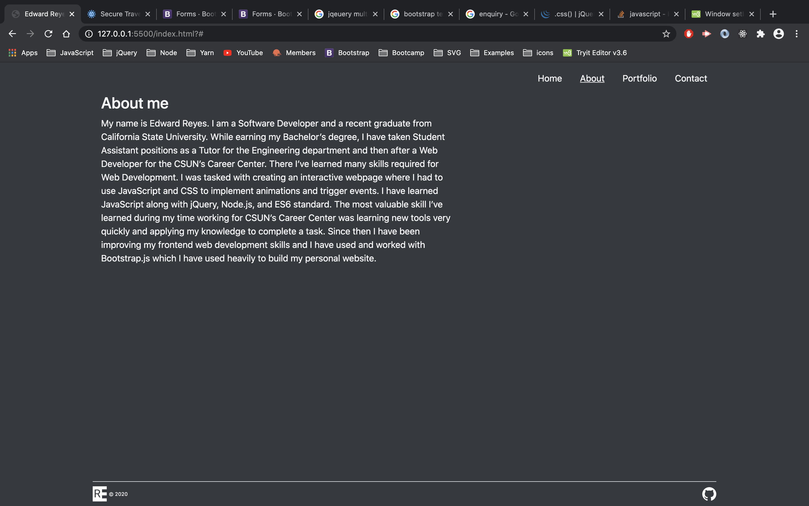

# Portfolio

## AUTHOR

Edward Reyes

## CONCEPT
I updated my portfolio to have a more simple aesthetic. I've also added more recent projects and will be adding more soon.

## Site information Display
  * Home page that changes background color every 8 seconds (home page only)
  * About me
  * My projects
  * Contact form

## Process
  ### Front End Development
  * Used HTML, CSS, and Booststrap
  * Used Bootstrap primarily for row/col alignment, centering, spacing, and text    color.
  * Used css to tweak spacing, background color, spacing between main-content and footer, and more.
    
  ### Back End Development
  * I used jQuery to render project images and modals dynamically. My project information are stored in an object in the index.js file that will generate the appropriate number of project displays, modals, and carousels within modals based on the number of projects in the projects object. This was done to keep the code as non repetitive as possible. The index.html file would have been significantly longer if I coded all project containers, modals, and carousels directly.

### Technologies used:  
  HTML, CSS, Bootstrap, JavaScript, jQuery

## LINK TO DEPLOYED APPLICATION / GITHUB

[GitHub Pages](https://edwardreyes29.github.io/portfolio/)

## Screen shots

## Final result

### Home variations

## About page

## Portfolio page

## About page
